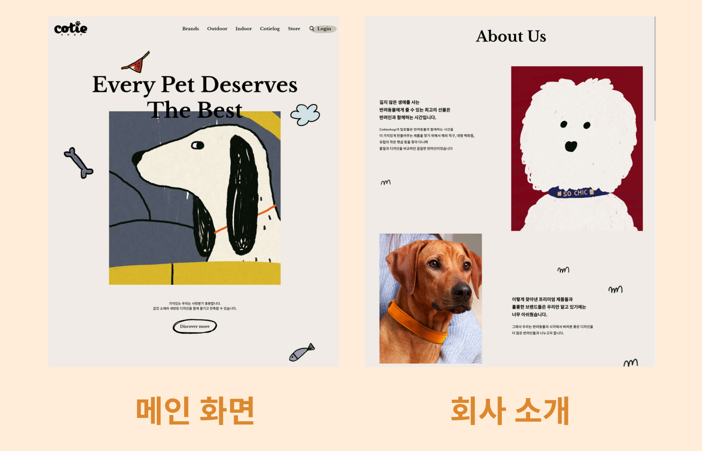
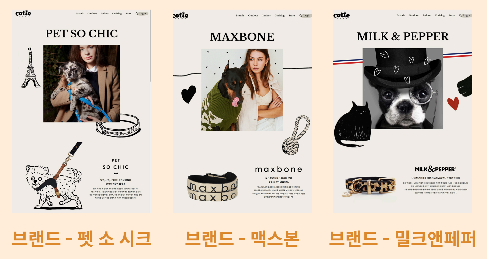
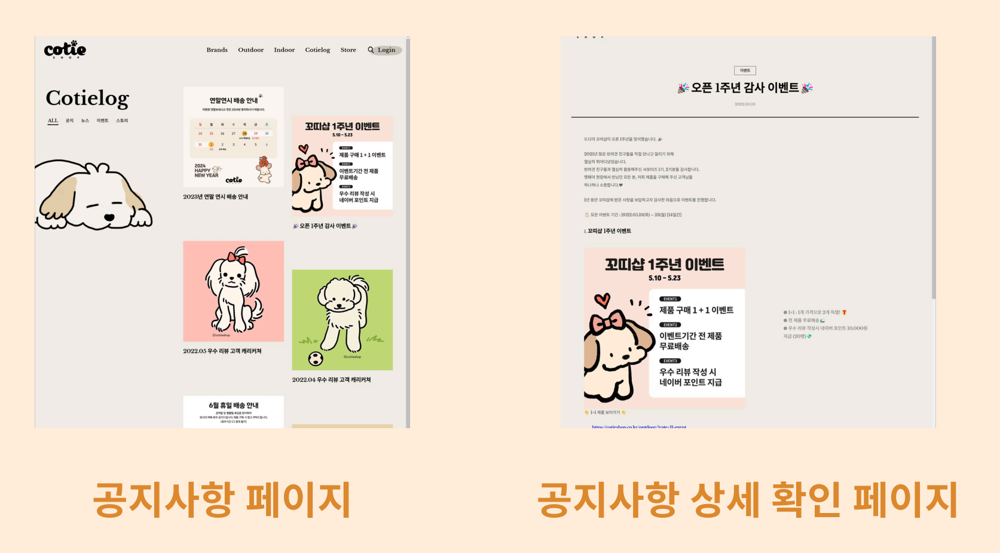
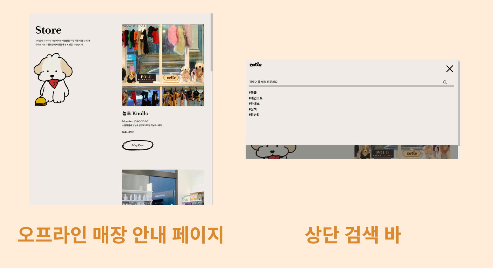
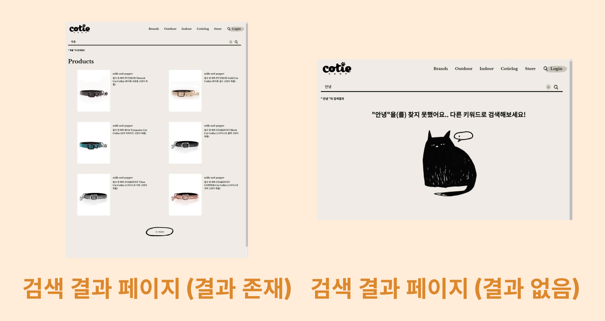
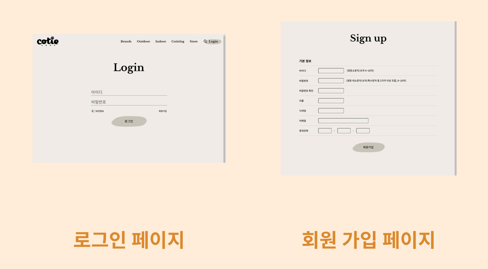
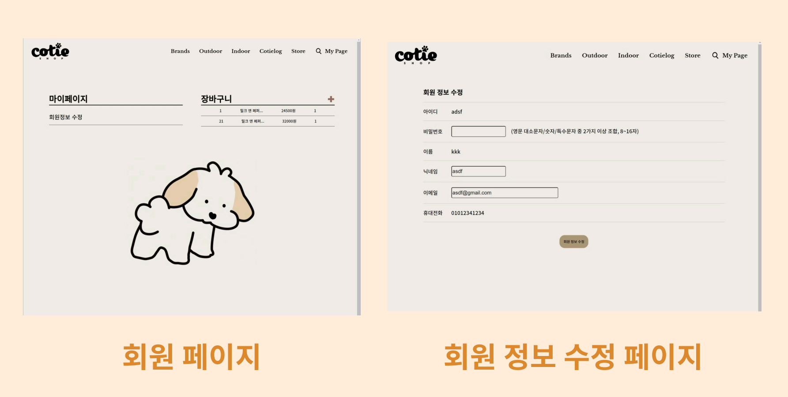
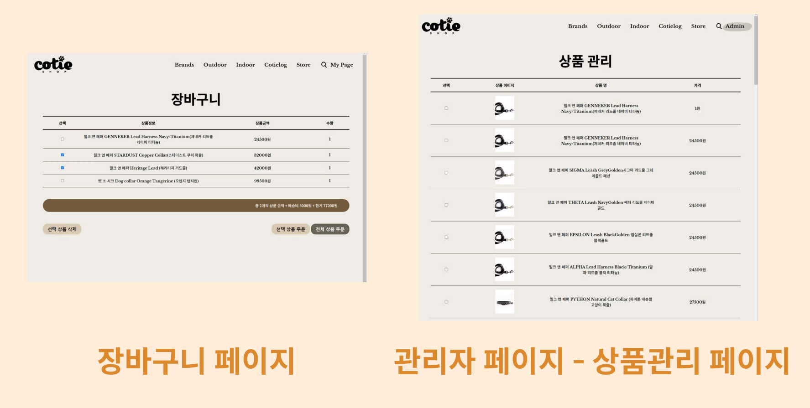
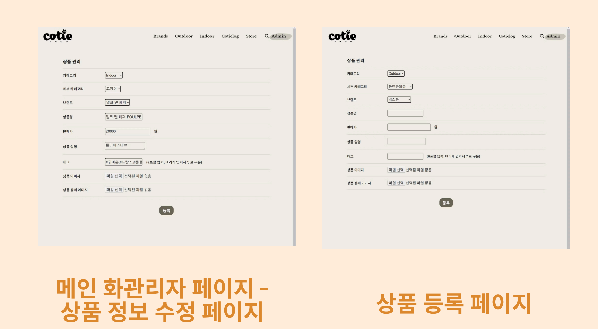
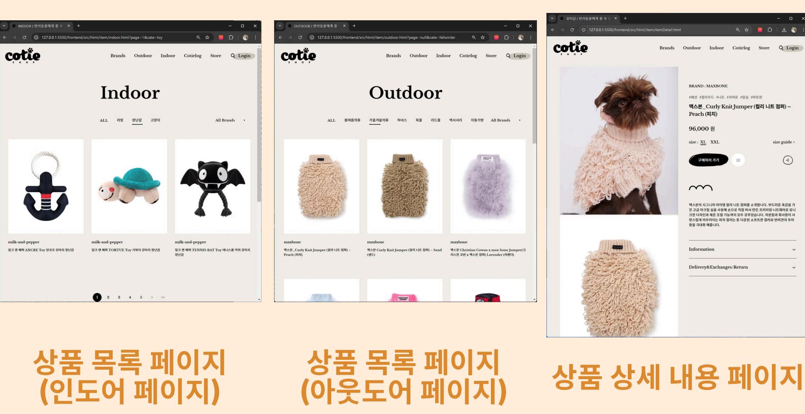

# 클론 코딩 프로젝트

## 개요
본 프로젝트는 꼬티샵(https://cotieshop.co.kr) 웹사이트를 클론 코딩하는 것을 목표로 진행되었습니다.

실제 사이트의 레이아웃, 디자인, 기능 등을 최대한 동일하게 구현하였으며, 이를 통해 웹 개발 역량을 강화하고 실무에 가까운 경험을 쌓는 데 중점을 두었습니다.

특히, 원본 사이트의 화려한 CSS 스타일을 충실히 재현하는 데 집중했으며, 단순한 클론 코딩을 넘어 로그인/회원가입 기능, 마이페이지, 관리자용 상품 관리 페이지 등 원본 사이트에 없는 기능들도 직접 구현하여 기존 사이트를 보완하였습니다.

## 주요기능

